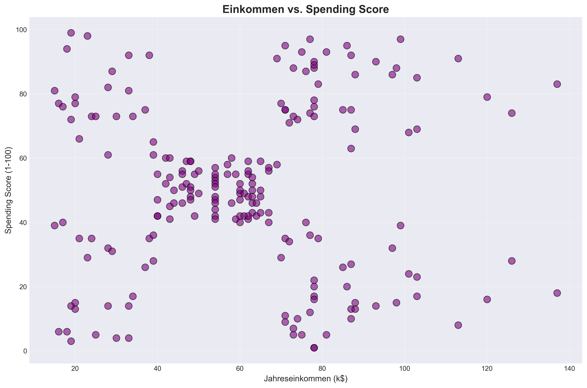
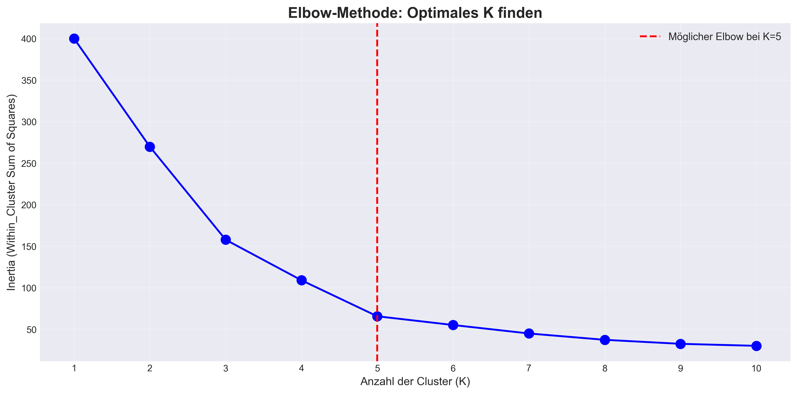

#  Kundensegmentierung mit K-Means Clustering

Ein Machine Learning Projekt zur Segmentierung von Mall-Kunden basierend auf Einkommen und Kaufverhalten.

##  Projekt-Übersicht

Dieses Projekt verwendet K-Means Clustering, um Kunden in 5 unterschiedliche Segmente einzuteilen und daraus Marketing-Strategien abzuleiten.

##  Ergebnisse

- **5 Kundensegmente** identifiziert
- **Premium-Kunden** (19.5%) mit höchstem Umsatzpotenzial
- **Wachstumspotenzial** bei sparsamen Reichen (17.5%)

##  Technologien

- Python 3.x
- Pandas, NumPy
- Matplotlib, Seaborn
- Scikit-learn (K-Means, StandardScaler)
- Jupyter Notebook

##  Installation
```bash
# Repository klonen
git clone <dein-repo>

# Virtuelle Umgebung erstellen
python -m venv venv
source venv/bin/activate  # Mac/Linux
venv\Scripts\activate     # Windows

# Abhängigkeiten installieren
pip install -r requirements.txt

# Jupyter starten
jupyter notebook
````
## Struktur

customer_segmentation/  
├── data/                # Dataset  
├── notebooks/           # Jupyter Notebooks  
├── outputs/             # Visualisierungen & Reports  
└── requirements.txt     # Python-Pakete  

## Visualisierungen

  




